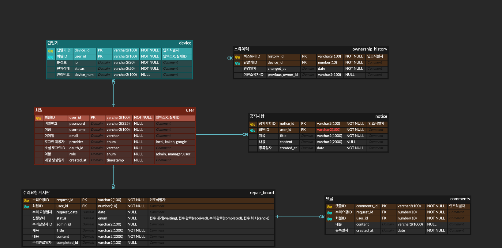

# 💻 노트북 관리 시스템 (Laptop Management System)
교내 노트북의 수리 요청, 소유자 관리를 위한 웹 애플리케이션입니다.
학생은 수리 신청을, 관리자는 요청 승인과 노트북 관리 기능을 수행할 수 있습니다.

---

## 🚀 주요 기능

- 학생 로그인 (일반 로그인 / 카카오 및 구글 로그인 예정)
- 노트북 수리 신청 및 내역 확인
- 수리 승인 / 반려 기능 (관리자)
- 노트북 현재 상태 및 소유자 관리
- 관리자 / 학생 역할에 따라 기능 분리

---

## 🛠 사용 기술

- Java 17
- Spring Boot 3
- Spring Security: 로그인 및 권한 인증
- Spring Data JPA: ORM 기반 DB 연동
- Thymeleaf: 템플릿 엔진 (서버 사이드 렌더링)
- H2 Database: 개발/테스트용 인메모리 DB
- MySQL: 운영 환경용 관계형 데이터베이스
- Gradle: 빌드 및 의존성 관리 도구

---
## 🗂 ERD (Entity Relationship Diagram)

---

## 📁 브랜치 전략

- `main`: 안정된 최종 코드
- `feature/*`: 기능 개발용 브랜치

👉 [브랜치 관리 가이드 전체 보기](./docs/branch_guide.md)
  예: `feature/repair-request`, `feature/admin-login`

👉 자세한 브랜치 사용법은 [docs/branch_guide.md](./docs/branch_guide.md) 참고
---

## 🧑‍💻 협업 규칙

- 브랜치는 `feature/기능명` 형태로 생성
- 기능 완료 후 GitHub에서 Pull Request 생성
- 팀원이 코드 확인 후 `main`에 머지
- 커밋 메시지 컨벤션:
    - `feat`: 새로운 기능
    - `fix`: 버그 수정
    - `docs`: 문서 수정
    - `refactor`: 코드 구조 개선

---

## 📦 실행 방법

1. 레포지토리 클론
   git clone https://github.com/your-id/laptop-repair-system.git

2. 브랜치 생성
   git checkout -b feature/repair-request

3. 실행
   ./gradlew bootRun
   또는 IntelliJ에서 `DemoApplication` 실행

---

## 📌 향후 계획 (Upcoming Features)

- [ ] 로컬 로그인 기능 구현
- [ ] 카카오톡 로그인 연동
- [ ] Google 로그인 연동

### 🛠️ 수리 기능 관련

- [ ] **수리 요청 폼 구현**  
  학생이 실제 수리를 요청하는 폼 (고장 증상, 첨부파일 등 입력)  
  → 요청 등록 → 승인 → 완료 처리 흐름 연동

- [ ] **수리 요청 게시판 구현**  
  학생과 중간관리자가 수리 관련 질문/공지를 주고받는 게시판  
  → 게시글 + 댓글 구조, 권한 분리

- [ ] **관리자 수리 승인 및 완료 처리 화면 구현**  
  중간관리자가 수리 요청을 처리(승인/거절/완료)할 수 있는 UI 구성

### 💻 시스템 기능

- [ ] 노트북 현황 조회 기능 개선 (관리번호/IP/소유자 정렬 및 검색)
- [ ] 노트북 소유 이력 확인 기능 (변경 이력 리스트)
- [ ] 알림 기능 (이메일 또는 웹 푸시 알림)
- [ ] 모바일 반응형 UI 지원 (Thymeleaf + Bootstrap)

---

## 👨‍👩‍👧‍👦 기여자

- 정진수 (frontend)
- 임연화 (backend)