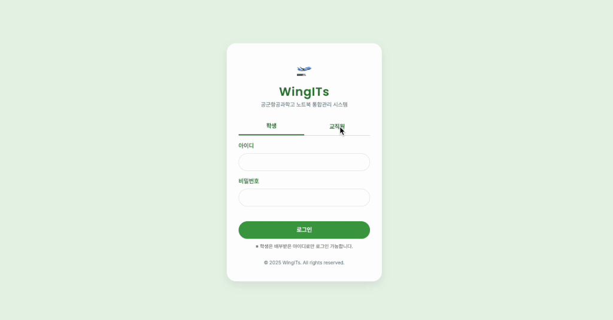
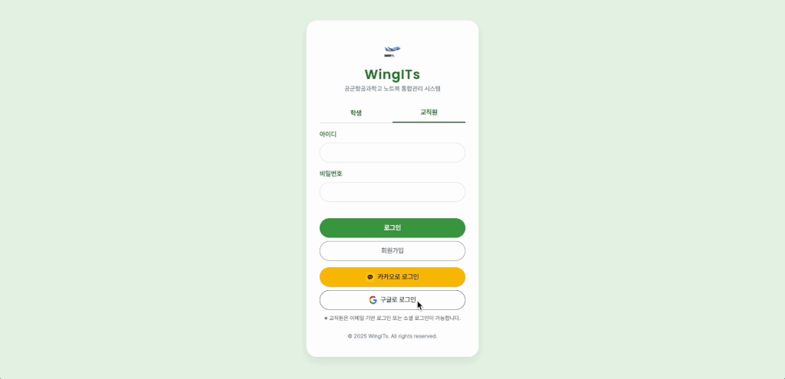
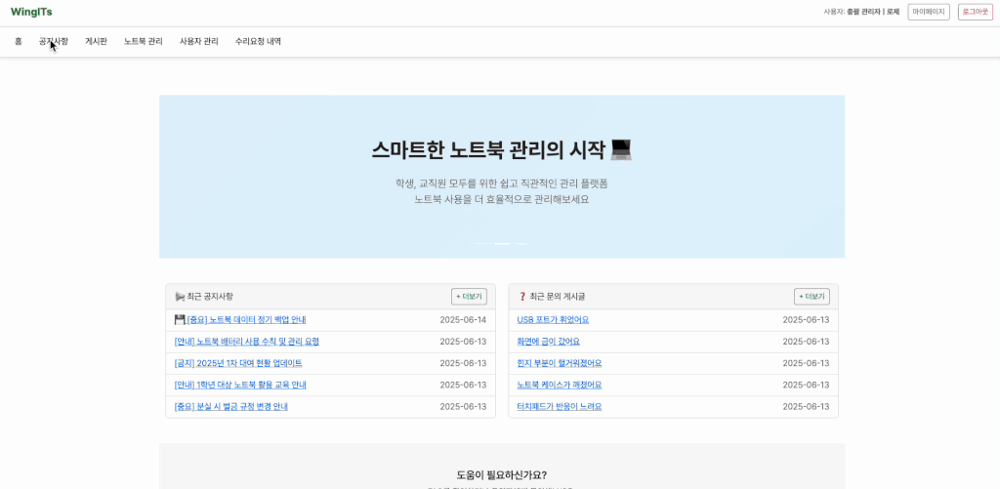
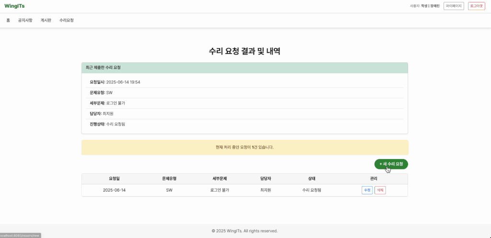
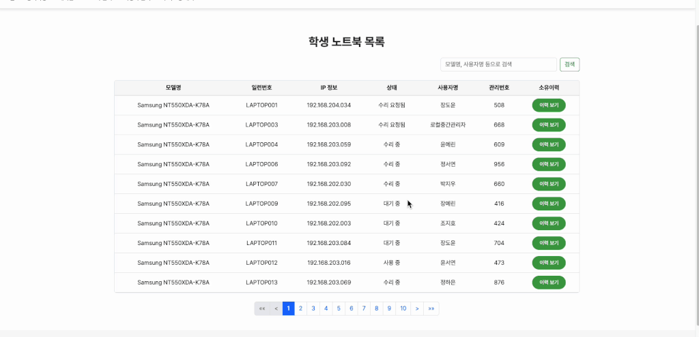
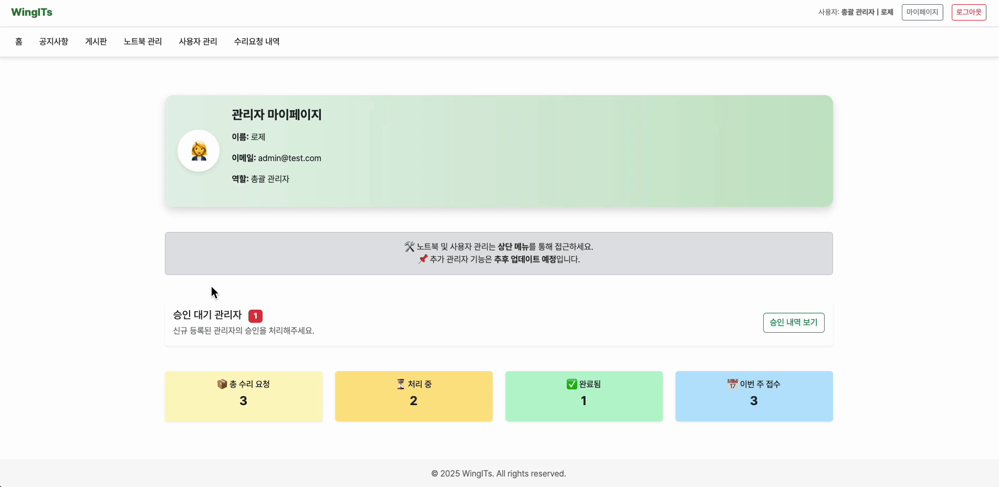

# 💻 WingITs: 노트북 관리 시스템

**WingITs**는 군부대 공군항공과학고등학교 내 노트북 수리 요청 및 소유자 관리를 위한 웹 기반 시스템입니다.  
실제 근무 환경에서의 불편함을 해소하고자 직접 기획하고 개발한 프로젝트로, 학생과 관리자의 역할에 따라 기능이 명확히 구분됩니다.

---

## 📌 목차

- [프로젝트 개요](#-프로젝트-개요)
- [기간 및 기여자](#-기간-및-기여자)
- [기능 구현](#-기능-구현)
- [사용 기술 스택](#-사용-기술-스택)
- [느낀 점](#-느낀-점-개발-회고)
- [주요 기능별 스크린샷](#-주요-기능별-스크린샷)

---

## 📋 프로젝트 개요

- **목적**: 수작업으로 처리되던 노트북 수리 요청과 자산 관리를 디지털화
- **대상 사용자**: 항공과학고 학생 및 교직원
- **핵심 기능**:
  - 학생: 수리 요청 등록, 노트북 현황 확인
  - 관리자: 수리 요청 승인/반려, 노트북 상태 및 소유자 관리, 사용자 권한 변경 등

---

## ⏰ 기간 및 기여자

- **기간**: 2025.03 ~ 2025.06 (3개월)
### 🙋‍♀️ 기여자

<table>
  <tr>
    <td align="center">
        
      <strong>Lim Yeonhwa (임연화)</strong> 
Fullstack Developer 
[GitHub](https://github.com/dob-by) ・ [📫 Email](mailto:yeonhwalim03@gmail.com)
    </td>
  </tr>
</table>

### 🛠 역할 및 기여

- **프론트엔드**: UI/UX 구성, Thymeleaf 템플릿 작성, 화면 흐름 설계
- **백엔드**: Spring Boot 기반 도메인 설계, REST API, 인증/인가(Spring Security)
- **DB 설계**: MySQL 기반 테이블 구조 설계 및 데이터 흐름 설계
- **배포 환경**: Docker + MySQL 환경 구성, 실서버용 설정 적용
> *서비스 기획은 항공과학고 선생님과 협의하여 진행하였으며, 전체 시스템은 단독 개발하였습니다.*

---

## 🚀 기능 구현

### ✅ 공통 기능

- 로그인/로그아웃
- 마이페이지 (기본 정보 조회, 노트북 보유 현황)

### 🙋‍♀️ 학생 기능

- 수리 요청 등록 (증상 입력, 파일 첨부)
- 수리 요청 상태 조회
- 본인 노트북 정보 확인
- 게시판 게시글 및 댓글 작성

### 🛠 관리자 기능

- 전체 수리 요청 리스트 조회 및 상태 변경 (승인/반려/완료)
- 사용자 검색 (이름/군번/이메일)
- 사용자 역할 변경 (학생 ↔ 관리자)
- 노트북 현황 관리 (상태/소유자 변경)
- 노트북 소유 이력 열람
- 관리자 마이페이지 (승인 대기자 수 등 요약 정보 표시)
- 공지사항 작성, 수정, 삭제

---

## 🛠 사용 기술 스택

### 📌 Backend

- Java 17 / Spring Boot 3
- Spring Security (로그인 및 권한 처리)
- Spring Data JPA (ORM)
- Validation (유효성 검증)
- MySQL / H2 (테스트용)

### 📌 Frontend

- Thymeleaf (서버사이드 렌더링)
- Bootstrap (스타일링)

### 📌 Infra / DevOps

- Docker / Docker-Compose
- TablePlus (DB 관리)
- GitHub / GitHub Desktop (버전 관리)

### 📌 기타

- Apache POI (Excel 업로드)
- OAuth2 (Google, Kakao 예정)

---

## ✨ 느낀 점 (개발 회고)

> 🚀 실무에서 느낀 불편함을 해결하기 위한 개발이 가장 몰입도 높았고,  
> 백엔드 전반과 보안 흐름(Spring Security, OAuth2) 설계에 대해 실력을 한 단계 끌어올리는 계기가 되었습니다.

- 프로젝트를 처음부터 끝까지 직접 설계한 점에서 자신감이 생김
- 인증, 권한, 파일 업로드, DB 마이그레이션, Docker 등 전반적인 기술 스택을 실제로 적용하며 경험치가 급상승함
- 배포 이후 유지보수, 추가 기능 계획까지 고려하며 체계적인 프로젝트 흐름을 경험함

---
## 📷 주요 기능별 스크린샷

### 🧩 공통 기능

📥 학생 로그인 흐름

학생은 DB에 사전 등록된 정보를 기반으로 로컬 로그인합니다.  
- 아이디: 군번  
- 초기 비밀번호: 군번 + 생년월일 6자리

로그인 후 마이페이지로 이동하여 비밀번호를 변경하고,  
노트북 정보 및 수리 요청 기능을 사용할 수 있습니다.

  
📥 교직원 Local 회원가입 및 승인 흐름

  교직원은 이메일, 이름, 군번, 비밀번호를 입력해 로컬 계정으로 회원가입할 수 있습니다.  
  회원가입 후 로그인하면 추가 정보를 입력해야 하며, 총괄 관리자의 승인을 받아야 시스템을 이용할 수 있습니다.

  - 회원가입: 이름, 군번, 이메일, 비밀번호 입력 → 가입  
  - 로그인: 로컬 로그인 → `/admin/mypage` 페이지로 이동  
  - 추가 정보 입력 후 저장 → 승인 대기 상태 진입  
  - 승인되기 전에는 로그인 제한 안내가 표시됩니다.

  

  
🔐 교직원 OAuth 로그인 및 승인 흐름

  교직원은 카카오 또는 구글 계정으로 OAuth 로그인을 할 수 있으며,  
  최초 로그인 시 추가 정보를 입력하고 총괄 관리자의 승인을 받아야 합니다.

  - 로그인: 카카오 또는 구글 계정으로 로그인  
  - 최초 로그인 시 추가정보 입력 폼으로 이동  
  - 이름, 군번, 소속 등 추가 정보 입력 → 저장 
  - 승인 대기 상태 진입 → 승인되기 전까지 로그인 제한 안내 표시

  

  
🏠 메인 대시보드

  최근 공지사항 및 게시글 요약을 확인할 수 있으며, FAQ로 이동할 수 있습니다.

  

  
📑 공지사항 목록

  공지사항은 페이징, 검색, 파일 첨부 기능을 제공합니다.

  

  
🗣 게시판 목록 및 댓글

  게시글/댓글 작성과 조회수 확인이 가능합니다.

  

---

### 🎓 학생 전용 기능

  
🧑‍💻 마이페이지

  내 정보, 노트북 정보, 수리 내역 등을 확인하고 비밀번호를 변경할 수 있습니다.

  

  
📝 수리 요청 폼

  문제 유형과 상세 내용을 입력하여 수리 요청을 보낼 수 있습니다.

  

  
🧾 수리 요청 내역 조회

  본인이 제출한 요청의 상태를 확인할 수 있습니다.

  

---

### 🛠 관리자 전용 기능

  
🛠 전체 수리 요청 관리

  수리 요청 목록을 검색/조회하고 세부 내용을 확인하여 상태를 변경할 수 있습니다.

  

  
📋 노트북 관리

  전체 노트북 목록을 조회하고 소유자 변경 이력를 확인할 수 있습니다.

  

  
📂 노트북 사용자 관리

  
  사용자 검색 및 상세정보 확인이 가능합니다.
  
  총괄 관리자에 의해 노트북 소유자 및 상태 변경이 가능합니다.

  

  
🙋 승인 대기 관리자 목록

  관리자 등록 요청을 승인할 수 있습니다.

  

  
📊 관리자 마이페이지(통계)

  관리자 정보, 승인대기 관리자, 수리 요청 통계 정보를 시각적으로 확인할 수 있습니다.

  

